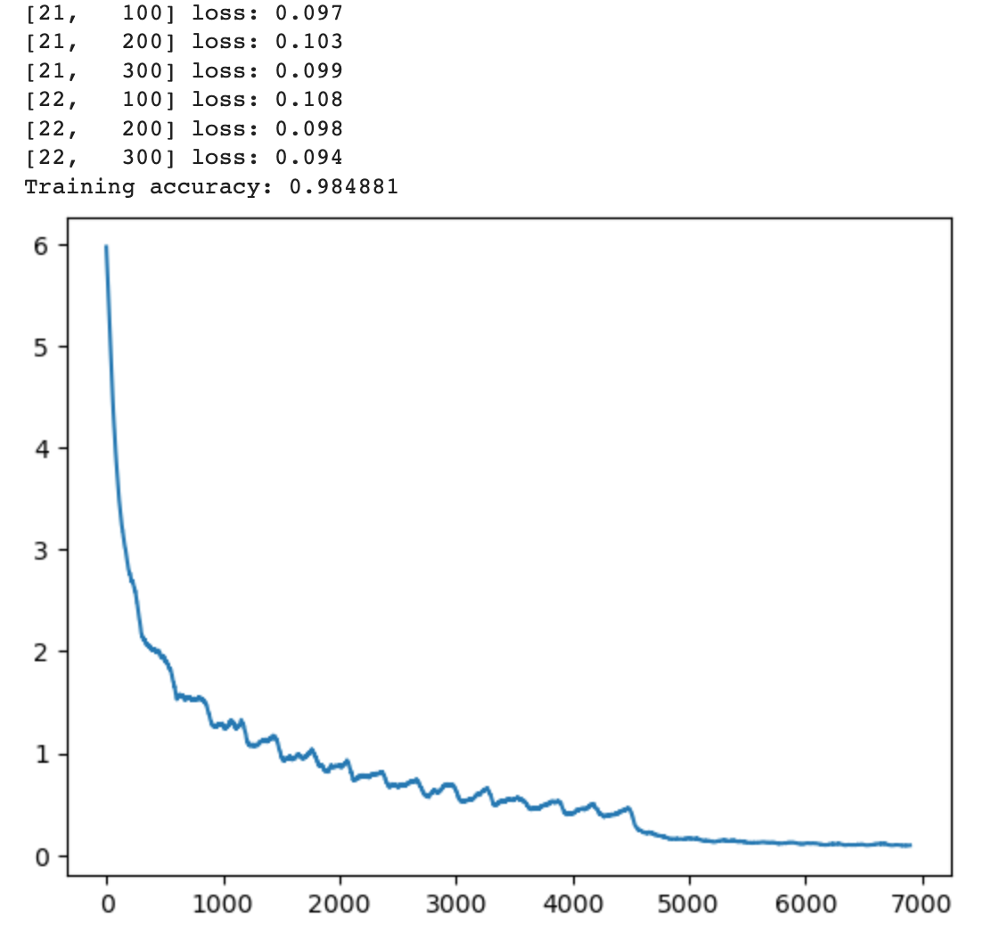

# Final Project: Bird-Classifier #

## Problem description ##
My project is to find a fine-tuned Kaggle Bird Classifier model. I am trying to use a classification model to train a variety of bird pictures so that the bird classifier can eventually identify what species the bird belongs to based on the picture provided by the user. I expect my classifier to end up with more than 80% accuracy.

## Previous work ##
### Pre-trained Model: ###
I used a pre-trained model for this project. I tried ResNet18 and ResNet50, and finally I have elected to use the ResNet50 model as my base model. This deep residual network has demonstrated strong performance on a wide variety of image classification tasks.  By starting with a pre-trained model, I can leverage the generic image features that the model has already learned, and focus on fine-tuning the model for my specific bird classification project.

## My approach ##
### Libraries: ###
I use the PyTorch library, a powerful open-source tool for machine learning applications, to develop and train a model for bird species classification.

### Transfer Learning: ###
I used transfer learning, meaning that I'll start with the pre-trained model, replace the final layer with a new layer that matches the number of bird species in my dataset. This approach will allow me to leverage the feature extraction capabilities of the pre-trained model and tailor them to my specific task.

### Hyperparameter Tuning: ###
Lastly, I tuned various hyperparameters to optimize the model's performance.  This involve tweaking learning rates, regularization weights, batch sizes, number of training epochs, or optimization algorithms. 

## Datasets ##
The training set and the test set are all from the Kaggle. The dataset contains images of more than 500 different species of birds. I use these images to train my model.

## Results ##
To develop the bird species classifier, I conducted several training sessions, each of which required extensive computational resources and time.  The total computational time exceeded 30 hours, utilizing the full extent of my available GPU quota.

My project code is here: [Githut project](./birdkaggle.ipynb) and [Kaggle project](https://www.kaggle.com/code/gangouyang/birdkaggle).

### Initial Training with ResNet18: ###
The project began with an initial training session using the ResNet18 model. The hyperparameters were set casually at this stage, which resulted in a modest training accuracy of around 60%.  This was an initial benchmark from which I aimed to improve.

### Transition to ResNet50 and Hyperparameter Optimization: ###
Recognizing the potential for improved performance, I transitioned to the deeper ResNet50 model for subsequent training sessions.  These sessions involved ongoing adjustments to key hyperparameters, specifically the learning rate and the number of training epochs per stage.  With each iterative adjustment and round of training, I observed continuous improvements in the model's performance, reflected in the steadily increasing training accuracy.

### Final Training Accuracy and Model Performance: ###
After extensive model training and hyperparameter optimization, the final training accuracy reached approximately 98%.  This was a significant improvement over the initial training session, suggesting the effectiveness of the adjustments made during the iterative training process.  However, when applied to the unseen test set, the model's accuracy was lower, around 74%.  This suggests that the model may have overfit to the training data to some extent.

The curve of the loss function over training epochs, as seen in the provided figure, provides further insight into the model's learning process.  The specific characteristics of the curve can help identify potential issues like overfitting or underfitting, learning rate misconfiguration, or other problems that might impact model performance.

Overall, while the final model performance on the test set did not reach the targeted 80% accuracy, the results nonetheless demonstrate substantial progress from the initial training session.  Further iterations on the model training and hyperparameter optimization process might be needed to achieve the targeted performance.

## Discussion ##
### What problems did you encounter? ###

The primary issue I faced during the project was model overfitting.  This was indicated by the discrepancy in performance between the training and test sets – achieving a high accuracy of around 98% on the training set but only about 74% on the unseen test set.  Unfortunately, due to the constraints of my GPU usage allowance, I was unable to continue refining the model to address this issue within the project timeframe.

One way I plan to address this overfitting issue is by increasing the regularization parameter, decay.  Regularization methods can help constrain the complexity of the model and reduce overfitting.  Furthermore, expanding my data augmentation techniques can also be beneficial as it creates a more varied dataset, forcing the model to learn more general features rather than memorizing the training data.

### Are there next steps you would take if you kept working on the project? ###

If I continue to do this project, I will consider:

#### Regularization & Data Augmentation: #### 
I plan to increase the weight decay regularization parameter and increase the use of data augmentation techniques.  These adjustments can reduce overfitting and improve the model's ability to generalize.

#### Increasing the Number of Epochs: ####
More training epochs could potentially improve model performance by giving it more opportunities to learn from the data.

#### Larger Model Architectures: ####
Considering the limits of RAM usage, I used the ResNet50 model. However, given more RAMs, I would like to experiment with larger models like ResNet101. Bigger models might capture more complex features, potentially improving classification performance.

#### Ensemble Methods: ####
I am also interested in exploring the combination of predictions from multiple models.  Ensemble methods can often improve performance by leveraging the strengths of each individual model.

### How does your approach differ from others? Was that beneficial? ###
My approach to this classification task primarily involved transfer learning using the pre-trained ResNet50 model. This is a common but effective strategy for dealing with limited data, as it allows us to leverage the features learned by the model on a large dataset, and fine-tune them for a specific task. Given the constraints of the project, this approach was particularly beneficial, enabling a good starting point for model performance which could be further improved with additional refinements.

